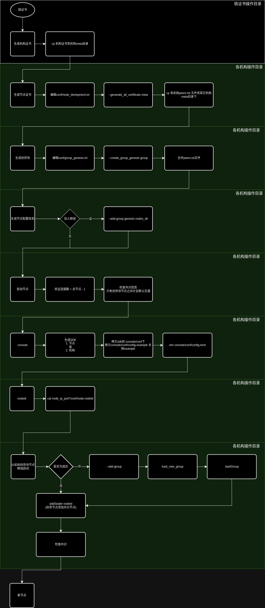

本项目用于快速创建Fisco实训环境，通过Docker来模拟多机的环境。

软件包含列表：

* SSH 套件(scp ssh sshd等服务)
* MySQL
* NGINX
* Default-JDK
* 修改 root 密码为`123456`
* 已安装WeBase构建工具Gradle
* 常见工具(net-tools、ping工具、tree命令、vim、python3等)

WeBase:

* Front: `git clone https://gitee.com/WeBank/WeBASE-Front.git`
* Sign: `git clone https://gitee.com/WeBank/WeBASE-Sign.git`
* Node-mgr: `git clone https://gitee.com/WeBank/WeBASE-Node-Manager.git`
* web: `git clone https://gitee.com/WeBank/WeBASE-Web.git`

以下是启动命令

```shell
chmod +x ./run.sh && ./run.sh 实例个数 实例前缀
```

> 启动命令会判断是否需要构建镜像，当 build 目录被修改时，会构建新的镜像

若你需要添加新的工具，只需要将其拷贝进入tools目录下即可。Webase相关工具包需要被编译后使用。

NGINX、Mysql等可以通过`service nginx start`、`servie mysql start`等进行管理

多机之间的文件传输，请使用`scp`命令。`ipconfig` 可查看当前机器ip

使用 `docker exec -it <实例前缀-x> /bin/bash` 进入实例中

## Fisco

Fisco 配置思路




## 相关文档

WeBASE：https://webasedoc.readthedocs.io/zh-cn/latest/docs/WeBASE/introduction.html

Fisco-Bcos: https://fisco-bcos-documentation.readthedocs.io/zh-cn/latest/